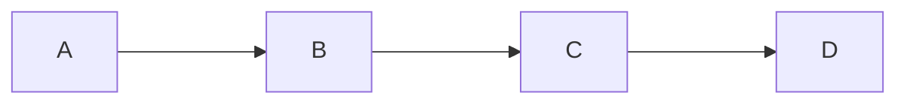

# Arbol Binario

```java
public class Node<T> {
    T value;
}
```

```puml
@stardot
diagraph G {
    A -> B;
    A -> C;
}

```

Un árbol empieza por la `raiz` quien es el nodo inicial, o el nodo padre. El nodo padre **NO** tiene padre, y los nodos `hijos` **NO** tienen hijos.

Todo nodo que se inserta es una hoja.

## Ramas y caminos

> Toda ruta de un nodo a otro

Todo árbol tiene una `altura` es el nivel más alto en el que esté un nodo.

La raiz siempre estará en el **nivel 1**, y sus hijos por consecuencia estarán en el **nivel 2**, por consiguiente se sigue el mismo patrón.

Para un árbol de altura `N` la cantidad de nodos máximos que tendremos es de $2^n - 1$.

La cantidad de nodos máximos en un nivel es de $2^{n-1}$

Un **Sub arbol** es simplemente tomar 3 nodos, una raiz, y sus dos hijos, la raiz puede ser local, no absoluta.

Por definicion la creacion de un árbol es recursiva.

Cuando un árbol está "lleno" se la llama **completo**

Cuando cada nodo hijo tiene 0 nodos hijos, se le denomina **arbol lleno** no debe de tener el mismo nivel precisamente.

**POR DEFINICION UN ÁRBOL BINARIO DE BUSQUEDA NO TIENE VALORES REPETIDOS**



Cuando todos los nodos tienen 0 sub arboles se le denomina **degenerado** es como una lista básicamente.

## Complejidad

La complejidad de un árbol binario es de $O(log(n))$ donde $n$ es la cantidad de nodos del árbol.

## Busqueda binaria

Se puede aplicar si manejamos datos **ordenados**.

### Árbol ginario de búsqueda BST (Binary Search Tree)

'Metodos con minúscula es privado, con mayus es publico'

```java
public class BST<T> {
    Node<T> root;

    public void Insert (T value) {
        insert(value, root);
    }

    private void insert(T value, Node<T> root) {
        if (value < root.value) {
            // Ir a la izquierda del árbol, sobreescribir en el nodo de la izquierda.
            if (root.left != null) {
                insert(value, root.left)
            } else {
                // Si a la izquierda no hay nodo, crear uno.
                root.left = new Node<T>(value)
            }
        }
        // Ir a la derecha del árbol
    } else if (value > root.value) {
        if (root.right != null) {
            insert(value, root.right)
        } else {
            root.right = new Node<T>(value)
        }
    } else {
        Throw new Exception()
    }
}
```

## Contains

```java
public boolean Contains(T value) {
    contains(value, root);
}

    private boolean contains(T value, Node<T> root) {
        if (value < root.value) {
            // Ir a la izquierda del árbol, sobreescribir en el nodo de la izquierda.
            if (root.left != null) {
                return contains(value, root.left);
            } else {
                // Si a la izquierda no hay nodo, crear uno.
                returnn false;
            }
        }
        // Ir a la derecha del árbol
    } else if (value > root.value) {
        if (root.right != null) {
            return contains(value, root.right);
        } else {
            return false;
        }
    } else {
        return true;
    }
```

_Recursividad_

```python
def factorial(num: int) {
    if (num == 1) return 1;

    return num * factorial(num - 1);
}
```

## Delete

```java
//Caso 1, eliminación de hojas
if (root.left != null && root.left.value == value) {
    //Caso 2, eliminación de subárboles con únicamente un subárbol, cambiar la conexión
    if (root.left.left == null && root.left.right == null) {
        root.left = null;
    }

    //Caso 3, cuando hay más subárboles

}
```
